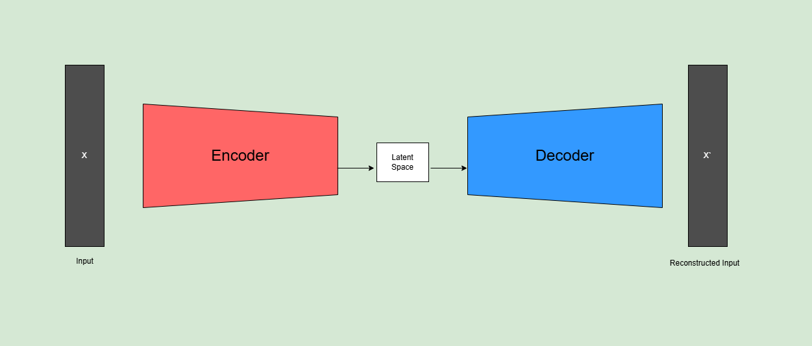
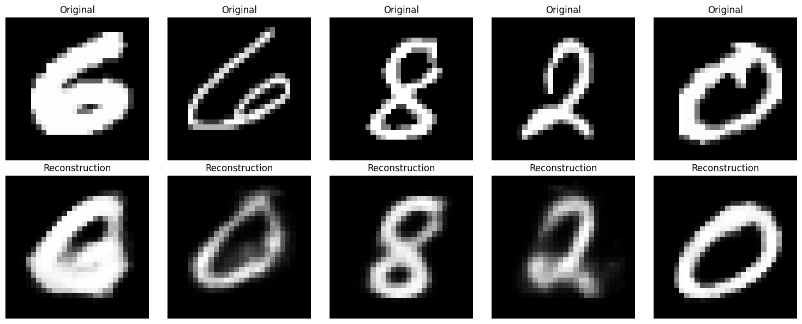
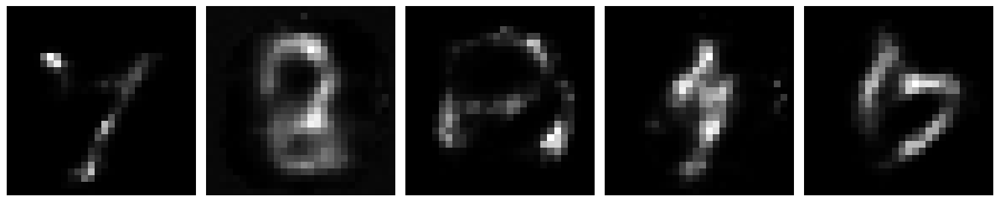
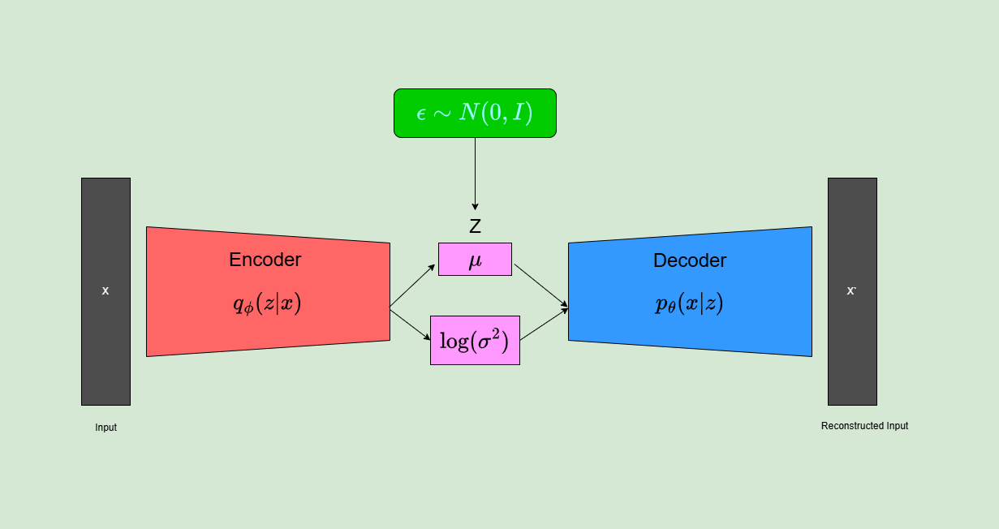
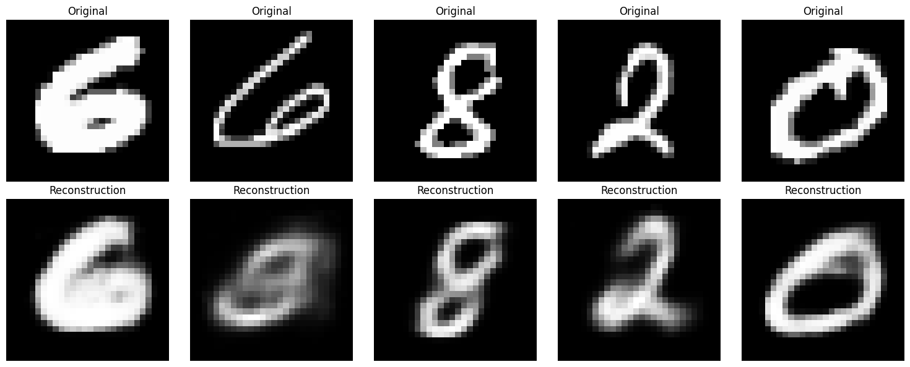
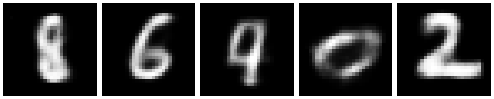
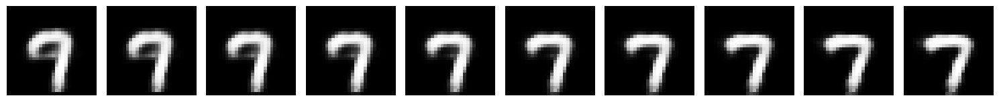
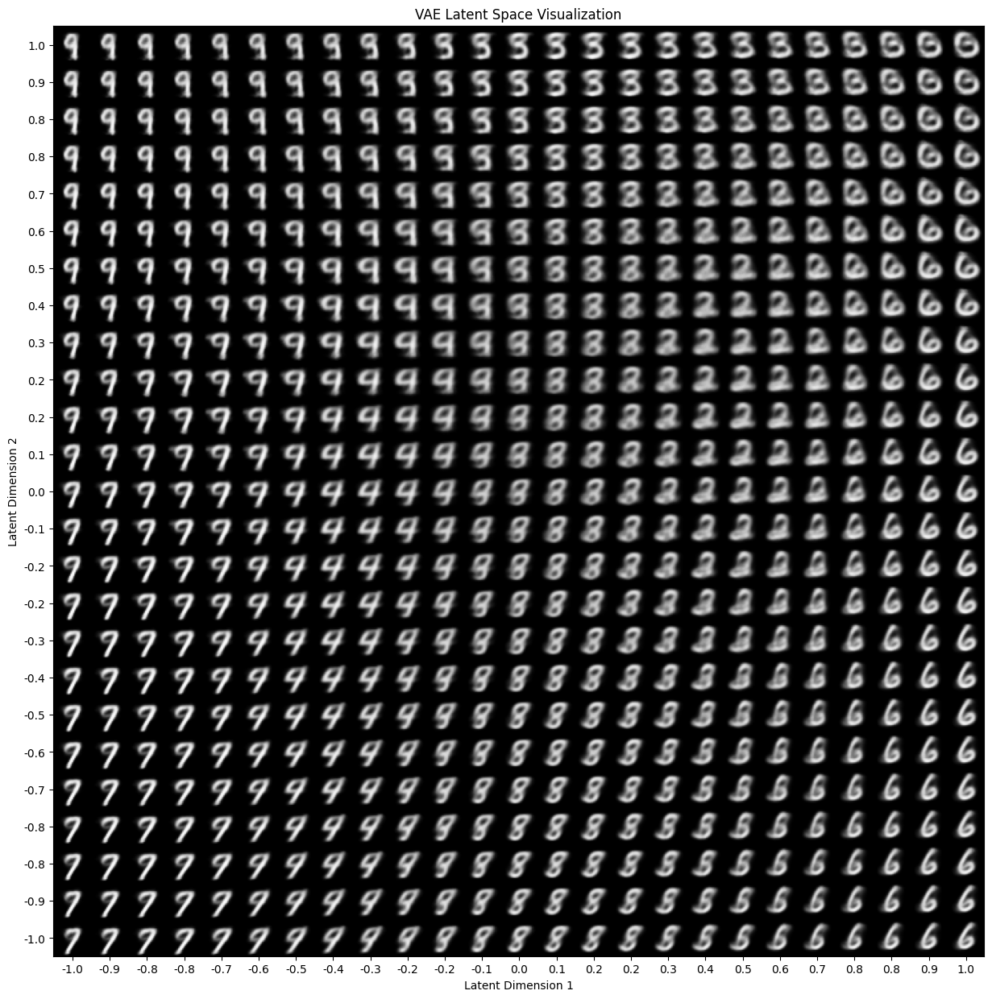

# Variational Autoencoder (VAE)
This project explores and implements ideas proposed in the landmark deep learning paper "Auto-Encoding Variational Bayes".

## Project Structure
- **`VAE.ipynb`**: The main notebook, containing exploration of the main ideas of the paper.

- **`VAE_implementation.ipynb`**: A notebook implementing first an Autoencoder and then a Variational Autoencoder using the ideas from the paper.

- **`Secondary files:`**:
    - **`helper_functions.py:`**: Helper functions for the project.
  

## Results

### Autoencoder

  

Reconstructions from an Autoencoder - only trained with reconstruction loss:

  

Attempting to generate new samples with the Autoencoder:

  

### Variational Autoencoder(VAE)

  

Reconstructions from a VAE - trained with reconstruction + KL Divergence loss:

  

Generating new samples with the VAE:

  

Impact of varying only one dimension of the latent vector on generated samples:

  

Visualizing an area of the latent space for a VAE with 2D latent:

  

### Paper and Blog References:

#### Papers:
- [x]  [Auto-Encoding Variational Bayes](https://arxiv.org/abs/1312.6114)  
- [x] [An Introduction to Variational Autoencoders](https://arxiv.org/abs/1906.02691) 
- [x] [Understanding Diffusion Models: A Unified Perspective](https://arxiv.org/abs/2208.11970)

#### Blogs:
- &nbsp; [The Reparameterization Trick](https://gregorygundersen.com/blog/2018/04/29/reparameterization/)
- &nbsp; [VAE from scracth](https://medium.com/@sofeikov/implementing-variational-autoencoders-from-scratch-533782d8eb95)

